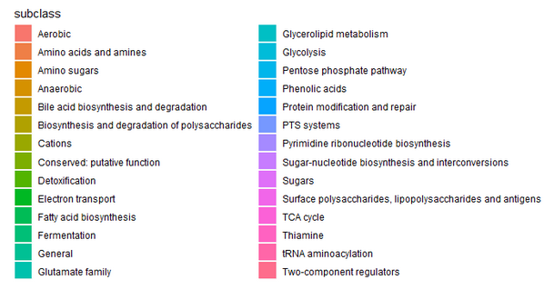
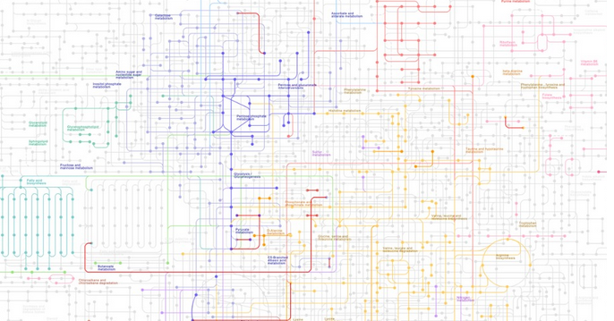

```{r setup , echo=FALSE}
knitr::opts_chunk$set(echo = FALSE)
library(edgeR)
library(ggplot2)
```

# Title Page

\newpage
# Abstract
For this study RNA-seq data was used to investigate the gene expression of _L. Plantarum_. In this study two samples of WCFS1 genes were cultivated on a Ribose base and on a Glucose base. This study was carried out to test whether genes required for metabolizing ribose are upregulated in _L. Plantarum_ grown on ribose-rich medium The data was normalized and filtered for low expressed genes. The fold changes were then calculated along with their adjusted p-values. The study concludes the hypothesis to be true, genes required for metabolizing ribose are upregulated when grown on a ribose rich medium. Further research could be done to determine in which capacity the genes are upregulated. Preferably this would be carried out with a larger sample size, as this study was limited by the size and reliability of the data provided. 

\newpage
# Introduction
In 2010, a whole-transcriptome of _L. Plantarum_ WFCS1 was deep-sequenced on the Illumina platform in cooperation of Wageningen University, NIZO and the Bacterial Genomics research group at the CMBI (Nijmegen, The Netherlands). NIZO and the Bacterial Genomics research group at the CMBI use _L. Plantarum_ WCFS1 as a model organism to study the biology of a bacterium that is also of commercial interest, e.g. in probiotics and for metabolic engineering. 
This organism is a Firmicutes that is a natural inhabitant of mammalian gastrointestinal tracts (Ahrne et al. 1998). The strain Lactobacillus plantarum WCFS1 is the first Lactobacillus for which the entire genome was determined (Kleerebezem et al, PNAS, 2003). With 3.3 million nucleotides, the genome of _L. Plantarum_ WCFS1 is among the largest Lactobacillus genomes (Kleerebezem, 2003) and comprises 3135 predicted genes, of which 3007 are protein-encoding (Refseq NC_004567). To further unravel the biological functions of proteins, learn about gene regulations and improve current genome annotation, whole-genome transcriptomes of _L. Plantarum_ WCFS1 under various growth conditions were collected.
(mogelijke begrippen uitleggen hier)
For this study, a whole-genome transcriptome of _L. Plantarum_ WCFS1 is used. The dataset has been generated using RNA-Seq and were derived from biological samples of _L. Plantarum_ grown on two different media (glucose versus ribose).
With the dawn of next generation (or deep) sequencing technologies in recent years (Ansorge, 2009; Metzker, 2010), their application to high-depth sequencing of whole transcriptomes, a technique now referred to as RNA-Seq, has been explored (Morozova et al., 2009; Wang et al., 2009; Wilhelm and Landry, 2009).
RNA-Seq requires a conversion of mRNA into cDNA by reverse transcription, followed by deep sequencing of this cDNA (van Vliet, 2010). RNA-Seq was initially only used for analysing eukaryotic mRNA, as prokaryote mRNA is less stable and lacks the poly(A) tail that is used for enrichment and reverse transcription priming in eukaryotes. But these technological difficulties are being overcome, as various methods for enrichment of prokaryote mRNA and appropriate cDNA library construction protocols have been developed, some generating strand-specific libraries which provide valuable information about the orientation of transcripts.
In June 2008, the first reports appeared of RNA sequencing of whole microbial transcriptomes, i.e. the yeasts Saccharomyces cerevisae (Nagalakshmi et al., 2008) and Schizosaccharomyces pombe (Wilhelm et al., 2008). Both studies demonstrated that most of the nonrepetitive sequence of the yeast genome is transcribed, and provided detailed information of novel genes, introns and their boundaries, 3′ and 5′ boundary mapping, 3′ end heterogeneity and overlapping genes, antisense RNA and more.
Starting in 2009, several examples have been reported of prokaryote whole-transcriptome analysis using tiling arrays and/or RNA-seq. The first reviews of prokaryote transcriptome sequencing have just appeared (Croucher et al., 2009; van Vliet andWren, 2009; Sorek and Cossart, 2010; van Vliet, 2010).
 
The dataset is used to compare the change of gene expression of _L. Plantarum_ across different growth conditions and to identify genes that are significantly up- or down regulated when grown on ribose. These genes have been identified using R by first normalizing and filtering the data for low expressed genes followed by calculating fold changes and making a selecting of the top genes. These top genes were further analyzed using KEGG mapper and an annotation file for Pathway Enrichment Analysis.
(waarom word dit gedaan???? Search for the catabolite responsive element upstream to the selected genes.) (bevindingen..)


\newpage
# Material & Methods

The dataset is used to compare the change of gene expression of _L. Plantarum_ across different growth conditions and to identify genes that are significantly up- or down regulated when grown on ribose. These genes have been identified using R by first normalizing and filtering the data for low expressed genes followed by calculating fold changes and making a selection of the top genes. These top genes were further analyzed using KEGG mapper and an annotation file for Pathway Enrichment Analysis.

## Data collection
The dataset has been collected and filtered via RNA-seq. Data was represented in two files, one consisting of gene identifiers and their read count for each sample, the second holding their annotation.

```{r echo=FALSE}
fDir <-  "D:\\GitHub\\Course6Tutor\\R"
fName <- "\\data\\WCFS1_cnts.txt"
```

```{r }
count_matrix <- read.delim(paste0(fDir,fName), comment.char="#")
WCFS1_anno <- read.delim2("data\\WCFS1_anno.txt")
### used for topTags identification
row.names(count_matrix) <- count_matrix[,"ID"]

# makes groups names
exp <- c("WCFS1.glc","WCFS1.glc","WCFS1.rib","WCFS1.rib")

# makes a factor of those group names
group <- factor(exp)

# makes a DGE list for easy editing 
# using only the counts( colom 2 to 5) 
# using the factors as groups
y <- DGEList(counts=count_matrix[,2:5],group=group)
```


## Data preprocessing

### Normalisation
To normalize and filter the data EdgeR has been used. There has been made use of the functions DGEList for easy editing followed by calcNormFactors using the trimmed mean method(TMM) to normalize. This method normalized by removing the lowest and highest values (percentile) and calculating mean.


```{r}
# Normalise counts
# Trimmed mean of M values : remove lowest and highest values
# (percentile) and calculate mean

y <- calcNormFactors(y, method="TMM" )
```


### Check statistics
To test these results the method summary is used to show the statistics of the counts in the dataset.


```{r }
print("Count statistics")
print(summary(y$counts))
print(y$samples)

```


### Create matrix
Next the dispersion was estimated this was done by first creating a design matrix using the model.matrix function. This design is used to let R know the 2 groups.

```{r}
# Create design matrix to let R know what is what
design <- model.matrix(~0+group, data=y$samples)
colnames(design) <- levels(y$samples$group)
print(design)
```


# Estimate Dispersion
To calculate the dispersion three methods have been used  `estimateGLMCommonDisp`, `estimateGLMTrendedDisp(method="bin.spline")`. and `estimateGLMTagwiseDisp`. The recommended parameter for datasets with more than 200 genes for the `estimateGLMTrendedDisp` function is `method="bin.spline"`.


```{r}
y <- estimateGLMCommonDisp(y,design)
y <- estimateGLMTrendedDisp(y,design, method="bin.spline")
y <- estimateGLMTagwiseDisp(y,design)
```

### Checking Dispersion
The outcomes of these functions were added to the DGE list and inspected by making an MDS plot and a BCV plot. 


# Determine fold changes
Construct the contrast matrix corresponding to specified contrasts of a set of parameters.


## Data processing
To process the collected data first the foldchange was determined. This was done by fitting a negative binomial generalized log-linear model to the read counts for each gene using the glmFit method followed by making a contrast using the makeContrast method to determine “glc vs rib” or “rib vs glc” 

```{r}
mc <- makeContrasts(exp.r=WCFS1.glc-WCFS1.rib, levels=design)
fit <- glmFit(y,design)
```

and making a glmLRT with the data gathered by the glmFit. 

```{r}
fit <- glmLRT(fit, contrast=mc)
```

glmLRT conducts likelihood ratio tests for one or more coefficients in the linear model and so decides which genes are upregulated, downregulated or not significant. To get a list of the most differentially expressed genes ,ranked on either p-value or absolute log fold change, the toptags method has been used on the glmLRT data.

```{r}
res<-topTags(fit)
print(res)
```

To inspect this data it was visualized using the plotMD method

Now that the foldchange was determined, a selection of differentially expressed genes had been made using only the genes with a p-value lower than 0.05 and a fold change lower than -2 or higher than 2.

```{r}
DE_Genes<- fit$table[which(fit$table$PValue < 0.05), names(fit$table) %in% c("logFC","LogCPM","LR","PValue")]
DE_Genes<- DE_Genes[which(DE_Genes$logFC < -2 | DE_Genes$logFC > 2), names(DE_Genes) %in% c("logFC","LR","PValue")]
```

This selection was then merged with an annotation file containing the ORF, start, stop , orientation, name, function, class, subclass, EC number and subcellular location.


```{r echo=FALSE}
library(dplyr)
names1 <- row.names(DE_Genes)
names2 <- DE_Genes[1]
names <- data.frame(genes = names1, Foldchange = names2 )
comp <- merge(WCFS1_anno,names, by.x = "ORF",by.y = "genes")
```


Analyzing
To gain insight in what genes were connected to metabolizing of ribose, keggmaper was used together with the annotation file using the function, class and subclass to determine if ribose was involved.


```{r}
sub <- select(filter(comp, comp$EC != ""),c("EC"))
comp2 <- semi_join(comp,sub, by = c("EC" = "EC"))
```

All genes that had a known EC number were selected and put into keggmapper, the found pathways were examined. To visualize the data in the annotation file a barplot was made using ggplot2, showing the foldchange of every gene colored by their class and another plot with the same but colored by their subclass. Catabolite responsive elements were analyzed???


\newpage
# results


### Figure 1 - MDS plot

```{r}
plotMDS(y)
```
This is a two dimensional scatter plot showing the distances approximating the log2 fold changes between the two samples.
Relatively the difference between the glucose and ribose samples are larger than the difference between the two types of samples. To be exact 0.9 between the glucose samples in the y dimension and almost no difference between the ribose samples on both dimension, while the difference between the different types of samples is at minimum 3.0 and 0.4 in the x and y dimensions respectively.


### Figure 2 - BCV plot
```{r}
plotBCV(y)
```
Figure2. In this Biological Coefficient of Variation (BCV) plot you can see the genewise biological coefficient of variation against gene abundance, in log2 Counts Per Million (CPM). The BCV appears to be higher when the average log2 CPM is lower . 


### Figure 3 - MD plot

```{r}
plotMD(fit)
```
 In this Mean Difference (MD) plot the log fold changes are plotted against the average log CPM. Here you can see that there is a difference in the amount of up- or downregulated genes and the variation in the log fold change. There are more downregulated genes and between these genes the variation in log fold change appears bigger. 
 
 
```{r}
library(ggplot2)
# plot with the foldchanges of every gene colored by subclass

plot_base <- ggplot(data = comp2, mapping = aes(x = name, y = logFC, width = 0.85,fill = class))
plot_base <- plot_base + theme(axis.text.x = element_text(angle = 90, size = 8))

plot_base <- plot_base + geom_bar(stat="identity", position="identity")

plot_base1 <- ggplot(data = comp2, mapping = aes(x = name, y = logFC, width = 0.85,fill = subclass))
plot_base1 <- plot_base1 + theme(axis.text.x = element_text(angle = 90, size = 8))
plot_base1 <- plot_base1 + geom_bar(stat="identity", position="identity")

plot_base
plot_base1
```
 


```{r}
summary(decideTests(fit))
```








